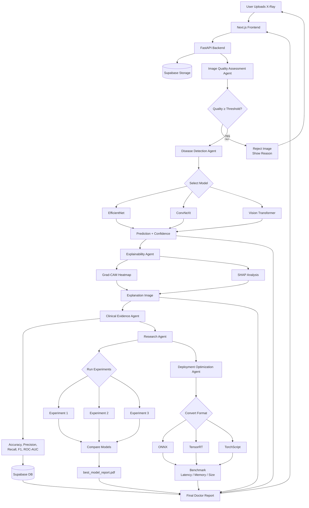
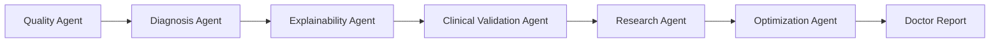

# MediSight AI

> Multi-Agent Medical Imaging Platform for chest X-ray analysis and diagnostic reporting.

MediSight AI is an end-to-end AI agent system that chains multiple specialized agents — quality assessment, disease detection, explainability, clinical validation, model research, and deployment optimization — to produce comprehensive diagnostic reports from medical images.

## Working Flow

### End-to-End Data Pipeline



### What Makes This an "AI Agent" Project?

Most pipelines stop at *Upload → Model → Prediction*. MediSight goes further:



### Data Flow Summary

| Step | Input | Processing | Output | Stored In |
|------|-------|-----------|--------|-----------|
| 1 | Raw X-Ray | Quality checks (blur, noise, etc.) | `{quality_score, status}` | Supabase Storage |
| 2 | Passed X-Ray | EfficientNet / ViT / ConvNeXt | `{prediction, confidence}` | Supabase DB |
| 3 | Prediction | Grad-CAM / SHAP | Heatmap overlay | Supabase Storage |
| 4 | Prediction + Heatmap | Metrics computation | `{accuracy, recall, f1, roc_auc}` | Supabase DB |
| 5 | Multiple model runs | Experiment comparison | `best_model_report.pdf` | Supabase Storage |
| 6 | Trained model | ONNX / TensorRT export | Optimized model + benchmark | Supabase Storage |

---

## Detailed Flow

### Step 1: Upload Medical Image

User uploads a **Chest X-Ray**.

- **Example:** `patient_xray_001.jpg`
- **Frontend:** Next.js
- **Backend:** FastAPI
- **Storage:** Supabase Storage

---

### Step 2: Image Quality Assessment Agent

**Goal:** Ensure image quality before diagnosis.

**Checks:**
- Blur
- Noise
- Brightness
- Contrast
- Resolution

**Input:** `patient_xray.jpg`

**Output (PASS):**
```json
{
  "quality_score": 92,
  "status": "PASS"
}
```

**Output (FAIL):**
```json
{
  "quality_score": 45,
  "status": "FAIL",
  "reason": "Image too blurry"
}
```

---

### Step 3: Disease Detection Agent

**Goal:** Predict disease.

**Models:**
- EfficientNet
- ConvNeXt
- Vision Transformer (ViT)

**Input:** X-Ray Image

**Output:**
```json
{
  "prediction": "Pneumonia",
  "confidence": 96.4
}
```

---

### Step 4: Explainability Agent

**Goal:** Show why AI predicted Pneumonia.

**Techniques:**
- Grad-CAM
- SHAP

**Creates:** Heatmap Overlay (Red Area → Infected Lung Region)

**Output:**
```json
{
  "explanation_image": "heatmap.png"
}
```

---

### Step 5: Clinical Evidence Agent

**Goal:** Evaluate model scientifically.

**Metrics:**
- Accuracy
- Precision
- Recall
- F1 Score
- Sensitivity
- Specificity
- ROC-AUC

**Output:**
```json
{
  "accuracy": 95.1,
  "recall": 94.8,
  "f1": 94.5,
  "roc_auc": 0.98
}
```

**Store results in:** Supabase

---

### Step 6: Research Agent

**Goal:** Automatically compare multiple models.

**Runs:**
- ResNet50
- EfficientNet
- ConvNeXt
- ViT

**Stores:**
- Experiment 1
- Experiment 2
- Experiment 3

**Example Comparison:**

| Model | Accuracy |
|-------|----------|
| ResNet50 | 91.2% |
| EfficientNet | 94.5% |
| ConvNeXt | 95.1% |
| ViT | 94.8% |

Research Agent automatically generates `best_model_report.pdf`.

---

### Step 7: Deployment Optimization Agent

**Goal:** Prepare model for production.

**Conversion Pipeline:**
```
PyTorch → ONNX → TensorRT → TorchScript
```

**Measures:**
- Inference Time
- Memory Usage
- Model Size
- CPU Performance
- GPU Performance

**Benchmark Output:**

| Format | Latency |
|--------|---------|
| PyTorch | 120ms |
| ONNX | 55ms |
| TensorRT | 20ms |

---

## Database Design (Supabase)

### Users
| Column | Type |
|--------|------|
| id | UUID |
| name | Text |
| email | Text |
| role | Text |

### Experiments
| Column | Type |
|--------|------|
| id | UUID |
| model_name | Text |
| accuracy | Float |
| precision | Float |
| recall | Float |
| created_at | Timestamp |

### Predictions
| Column | Type |
|--------|------|
| id | UUID |
| patient_image | Text |
| prediction | Text |
| confidence | Float |
| timestamp | Timestamp |

### Reports
| Column | Type |
|--------|------|
| id | UUID |
| report_url | Text |
| model_name | Text |
| generated_at | Timestamp |

---

## Final Dashboard Pages

| Page | Features |
|------|----------|
| **Dashboard** | Total Predictions, Best Model, Accuracy, Experiments |
| **Upload Scan** | Upload X-Ray, Run Diagnosis |
| **Research Lab** | Compare Models, View Metrics, Download Reports |
| **Deployment Center** | Export ONNX, Export TensorRT, Benchmark Results |

---

## Tech Stack

| Layer | Technology |
|-------|-----------|
| Frontend | Next.js |
| Backend | FastAPI |
| Database / Storage | Supabase (PostgreSQL + Object Storage) |
| AI / ML | PyTorch, ONNX, TensorRT |
| Explainability | Grad-CAM, SHAP |

---

## Getting Started

*Coming soon — the project is in its initial planning phase.*

## Project Status

Currently in the **planning and design phase**. Architecture decisions have been documented and implementation will follow.

## Author

- **Tisha Choksi** — [tishachoksi18@gmail.com](mailto:tishachoksi18@gmail.com)

## License

This project is licensed under the MIT License.
